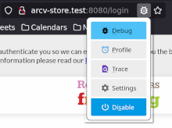
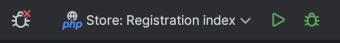

# DOCKER

Docker stuff has been moved to the [infra repo](https://github.com/neontribe/ARCVInfra) for now.

## Running the whole stack in containers

This command will pull and build the service/store and start it. The files in this project are mounted in the container, changes on the host files system will be reflected in the container.

```bash
echo "127.0.0.1   arcv-service.test arcv-store.test sqldb" | sudo tee -a /etc/hosts
docker compose -f .docker/docker-compose.yml up --build --force-recreate
```

 * Arc service is now available at http://arcv-service.test:8000/login
 * Mysql is available at ``mysql -ulamp -plamp -h127.0.0.1 -P3336 lamp`
 * Phpmyadmin is available at [http://arcv-service.test:8880/login](http://arcv-service.test:8800/index.php?route=/database/structure&db=lamp)
 * Mail catcher is available at http://arcv-service.test:1080/

### Using artisan

To use `artisan` you need to execute the command in the container: e.g.

```bash
docker compose -f .docker/docker-compose.yml exec service /opt/project/artisan tinker
```

Or you can open an interactive shell:

```bash
docker compose -f .docker/docker-compose.yml exec service bash
```

## Attach a debugger (PHPStorm)

Start the docker compose [as above](#running-the-whole-stack-in-containers)

### Set up your browser extension

 * Chrome: https://chromewebstore.google.com/detail/xdebug-helper/eadndfjplgieldjbigjakmdgkmoaaaoc
 * Firefox: https://addons.mozilla.org/en-US/firefox/addon/xdebug-helper-for-firefox/

The firefox extension defaults to eclipse as it's IDE, in the preferences, switch it to PHP Storm

### In PHPStorm

#### Set the project PHP interpreter to be lifted from the container

* Alt+Ctrl+s
* Search - PHP
* Click three dots next to "CLI Interpreter" (...)
* Click "+"
* Choose "From Docker, Vagrant, VM, WSL, Remote..."
* Choose "Docker"
* Choose New on the sever line, click OK
* Click OK
* Click OK

#### Create a run config

Wait for indexes to build in phpstorm, when PHP starts it takes a few seconds/minutes to build them, without the indexes it create a run config.  The **server** created in this section can be re-used in later run configs.

* Edit configurations (Run menu)
* Click "+" (Add new configuration)
* Choose "PHP Web page"
* Give it a name
* Click three dots next to "Server" (...)
* Click "+" (Add)
* Give it a name
* Set host to "arcv-service.test" and port to 8080
* Tick "Use path mappings"
* Set the "Absolute path on the server" that matches local project root to be "/opt/project"
* Click OK
* Click Run, see the service login page

#### Set a break point and run the debgger

* Open public/index.php
* Add a break point (Click next to the line numbers, see a red dot)
* Enable the debug browser extension, there's bug somewhere that needs to go green
* Turn on debug listener (Bug left of the run config)
* Click "debug" the run config

#### Example images

Enabling browser extension<br />


Php Storm run dialog, disabled<br />


Php Storm run dialog, enabled<br />


## Docker for just the DB

If you have a native PHP you can use a docker to provide your mysql DB. This is a transient docker, content will not persist between container restarts.

```bash
cp .env.example .env # <-- Only if you're a new install
docker run --rm -d --name arcv-mysql \
    -e MYSQL_DATABASE=$DB_DATABASE \
    -e MYSQL_USER=$DB_USERNAME \
    -e MYSQL_PASSWORD=$DB_PASSWORD \
    -e MYSQL_ROOT_PASSWORD=changemeplease \
    -p $DB_PORT:3306 \
    mysql:8
```


