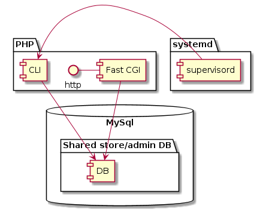

## Physical server set up

We have two Rocky linux virtual machines in a Digital Ocean cluster. The machines have their packages updated monthly.

### Staging

Basic / 4 GB / 2 vCPUs / 80Gb / $24.00 per month

### Live

8 GB / 4 vCPUs / 160Gb / $48.00 per month

## Software stacks

The staging server was hand rolled to provide the LAMP stack below. Live was a VM clone of staging. These have been live since March 2023 so may have some package drift.

```
[neontribe@rocky9-arc-staging ~]$ apachectl -v
Server version: Apache/2.4.57 (Rocky Linux)
Server built:   Jul 20 2023 00:00:00
[neontribe@rocky9-arc-staging ~]$  php-cgi -v
PHP 8.1.26 (cgi-fcgi) (built: Nov 21 2023 21:53:48)
Copyright (c) The PHP Group
Zend Engine v4.1.26, Copyright (c) Zend Technologies
    with Zend OPcache v8.1.26, Copyright (c), by Zend Technologies
[neontribe@rocky9-arc-staging ~]$ mysqld -V
/usr/libexec/mysqld  Ver 8.0.32 for Linux on x86_64 (Source distribution)
```

The ARC service comprises two server applications and one Vue.js single page app.

The server applications are both served from a single Laravel stack, switched on virtual host by Laravel. These persist shared data into a mysql server. The raw mysql files for this instance are:

```
[root@rocky9-arc-staging mysql]# du -sh .
208M    .
```

```
[root@Arc-live-04-2023 mysql]# du -sh .
20G     .
```

The Vue.js (2.x) single page application is served as statically built files that are served by the Apache instance via virtual host named switching. This app uses the Laravel instance as REST API to read/write data and carry out operations requested by the user.

The Vue.js application may be optionally persisted on phones that support the progressive web app conventions. It uses a service worker to cache locally and fetch new variations from the server when it sees them.

## Service Interaction

Defined in [server-components.puml](images/server-components.puml)



## SupervisorD and CronD managed processes

The system uses [Supervisord](http://supervisord.org/) to run a database backed queue worker with responsibilities like processing long-running tasks like fetching voucher histories.

There is a cron job that is run very frequently to execute Laravel's internal [task scheduling system](../app/Console/Kernel.php)  
