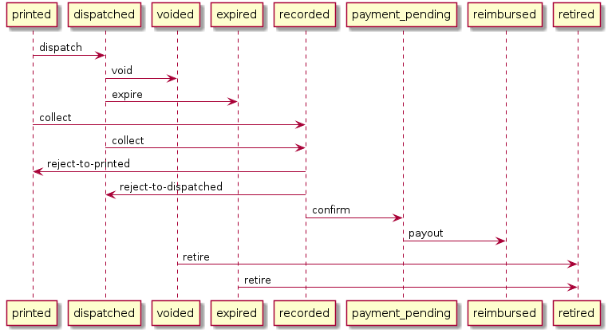

## Voucher state transitions

Defined in [voucher-state-transitions.txt](voucher-state-transitions.puml)

## Setting up vouchers for testing MVL

The seeder and the [VoucherState::batchInsert](https://github.com/neontribe/ARCVService/blob/84ec961bc7074c0aff1f6f2a09311a2ad6d9c94e/app/VoucherState.php#L49) overrides the created date with `now` so all our voucher states are clumped in a single day.

You need to run some sql to do that.

### Create the stored procedure

If you are using the [dev-helper](https://github.com/neontribe/ARCVInfra/tree/main/docker/dev-helper) docker stack:

    mysql -ulamp -plamp -P3336 -h127.0.0.1 lamp < docs/create-randomise-voucher-states.sql

Otherwise, you'll need to connect to mysql and run it yourself.  I think homestead users can do this, but I'm not sure, please update this document if this is wrong:

    mysql -uhomestead -psecret -P3306 -h127.0.0.1 homestead < docs/create-randomise-voucher-states.sql

### Run it

Just connect to the mysql instance and call it, dev help version:

    mysql -ulamp -plamp -P3336 -h127.0.0.1 lamp -e "CALL UpdateRandomTimestamps();"

And then check it worked:

    select count(*), created_at from voucher_states where `to` = 'reimbursed' group by created_at limit 30;

