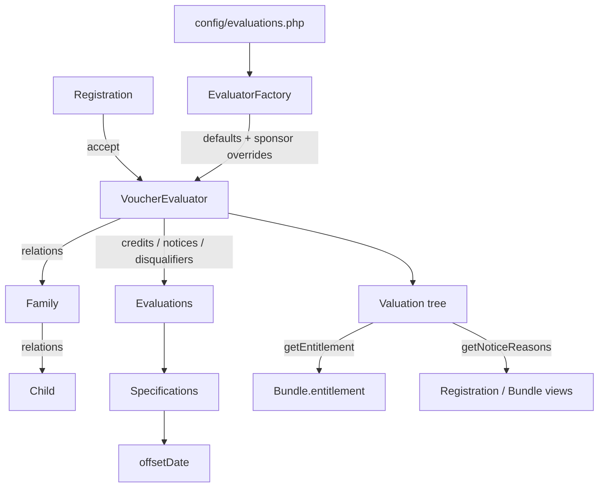

# Voucher Evaluator — Logic Audit

Audit of `app/Services/VoucherEvaluator` and `app/Specifications`: the visitor + specification
machinery that decides how many vouchers a household is entitled to, and which notices and
disqualification reasons a Store worker sees.

* **Audited at:** `nesbot/carbon 3.11.4`, `laravel/framework v12.55.1`, PHP `^8.2` (`composer.lock`).
* **Baseline test state (original audit):** `./vendor/bin/phpunit tests/Unit/Services/VoucherEvaluator` →
  `23 tests, 63 assertions, 2 skipped`, green. Both pre-existing skips were Scottish notice tests
  annotated `markTestSkipped('Waiting for hotfix')`
  (`tests/Unit/Services/VoucherEvaluator/ScottishVoucherEvaluatorTest.php:254` and `:277`).
* **Status of this document:** report only. **No production logic was changed by the audit.**
  Remediation is a separate, separately-approved piece of work — see
  [4. Remediation order](#4-remediation-order).
* **Revision (2026-09-15):** the `Scottish*` evaluations were rewritten after this audit was first
  published (commits `49ed1f98` “refactor scottish child evaluations for school age” and `2882057f`
  “refactor scottish deferrals and 'childisAlmost' rule”). [Section D](#d-scotland) has been
  re-audited against the new code: **F8, F9, F10, F11 and F12 are resolved** — the school-age logic
  now lives in three date-driven specifications (`IsScottishUnderSchoolAge`,
  `IsScottishAlmostStartDate`, `IsScottishDeferralEligible`, each with its own unit tests under
  `tests/Unit/Specifications/`), and the two `Waiting for hotfix` skips have been removed and pass.
  The original findings are retained below, marked **RESOLVED**, with notes on residual
  observations in the new code.
* **Revision (2026-09-16):** **F1 is resolved** — `Valuation::getNoticeReasons()` now merges
  `$this->flat('disqualifiers')` instead of the non-existent `'disqualifications'` key
  (`Valuation.php:47`). Disqualification reasons now reach notice consumers and the regression
  test `EvaluatorAuditTest::testAuditF1DisqualifierReasonsAreLostFromNoticeReasons` is un-skipped
  and passing.
* **Revision (2026-09-16):** **F2 is resolved** — `IsAlmostYears` (`IsAlmostYears.php:34`) and
  `IsAlmostStartDate` (`IsAlmostStartDate.php:44`) now use explicit month-boundary differences
  (`$this->offsetDate->copy()->startOfMonth()->diffInMonths($targetDate->copy()->startOfMonth(), false)`
  between 0 and 1) rather than truncating Carbon 3 signed floats with `(int)`. The "almost" notice
  window is strictly the current month and the month before. Mutable Carbon calls in `Child` and
  `IsUnderYears` were guarded with `->copy()`. Specification tests (`IsAlmostYearsTest`,
  `IsAlmostStartDateTest`) were added and `EvaluatorAuditTest::testAuditF2AlmostNoticeFiresAlmostTwoMonthsEarly`
  runs un-skipped as a regression test.

Every finding records **how it was verified**. *Confirmed* means it was proven by running code or by
inspecting the schema/migrations; *inferred* means it was established by reading only.

---

## 1. Summary & severity table

| # | Flaw | Area | Severity | Verified | Moves voucher totals? |
|---|------|------|----------|----------|-----------------------|
| [F1](#f1--disqualification-reasons-never-reach-the-ui) | `getNoticeReasons()` merges a non-existent `disqualifications` key | Valuation | ~~High~~ **RESOLVED** (2026-09-16) | confirmed | no |
| [F2](#f2--almost-notice-windows-are-two-months-not-one) | Carbon 3 `diffInMonths()` is a signed float, not an absolute int | Specifications | ~~High~~ **RESOLVED** (2026-09-16) | confirmed | no (warnings only) |
| [F3](#f3--stale-pregnancy-credits-and-twins-credited-once) | Stale / duplicate pregnancy credit | Family | **High** | confirmed | **yes** |
| [F5](#f5--the-household-has-left-guard-is-a-no-op-on-children) | `HouseholdMember` tests `leaving_on` on a `Child` | Social prescribing | **High** | confirmed | **yes** |
| [F8](#f8--the-injected-evaluation-date-is-ignored-entirely) | Scottish rules use `Carbon::now()`, not the injected `offsetDate` | Scotland | ~~High~~ **RESOLVED** (2026-09-15) | confirmed | no (blocked testing) |
| [F9](#f9--school-month-comparison-does-not-wrap-the-year) | School-month arithmetic does not wrap the year | Scotland | ~~High~~ **RESOLVED** (2026-09-15) | confirmed | **yes** — totals changed when fixed |
| [F10](#f10--scottishfamilyhasnoeligiblechildrens-specification-is-a-tautology) | `ScottishFamilyHasNoEligibleChildren` specification is always true | Scotland | ~~High~~ **RESOLVED** (2026-09-15) | confirmed | no |
| [F4](#f4--unborn-children-cause-a-permanent-needs-id-warning) | Unborn child counts as unverified | Family | Medium | confirmed | no |
| [F6](#f6--negative-entitlement-is-reachable) | Entitlement has no floor and can go negative | Social prescribing | Medium | confirmed | no (corrects a wrong total) |
| [F7](#f7--deductfromcarer-never-actually-tests-for-a-carer) | `$candidate->has('children')` is always truthy | Social prescribing | Medium | confirmed | no |
| [F11](#f11--deferral-is-ignored-the-moment-a-child-turns-5) | Deferral lost at the fifth birthday | Scotland | ~~Medium~~ **RESOLVED** (2026-09-15) | inferred | **yes** — totals changed when fixed |
| [F12](#f12--duplicated-divergent-at-school-logic) | `isScottishChildAtSchool()` triplicated and divergent | Scotland | ~~Medium~~ **RESOLVED** (2026-09-15) | inferred | no |
| [F13](#f13--asymmetric-upper-age-bound-design-question) | Asymmetric upper age bound | Child rules | Medium (*design question*) | inferred | depends on decision |
| [F14](#f14--a-family-level-disqualifier-silently-deletes-every-child-credit-by-design) | A family disqualifier zeroes the whole household | Valuation | Medium (*by design*) | confirmed | n/a |
| [F15](#f15--two-conflicting-definitions-of-pregnant-design-question) | Two conflicting definitions of "pregnant" | Family | Medium (*design question*) | inferred | depends on decision |
| [F16](#f16--basechildevaluationtoreason-drops-negative-values) | Negative Child values silently dropped | Evaluations | Low | confirmed | no (latent) |
| [F17](#f17--getpurposefilteredevaluations-collapses-same-named-rules) | `array_merge` collapses same-named rules | Evaluator | Low | inferred | no |

Of the findings still open, **F3 and F5 will change how many vouchers some households receive** if
corrected. (**F2** changes which warnings are shown but not totals; its correction shipped on
2026-09-16. **F9** and **F11** were also entitlement-affecting; their correction shipped with the
Scottish refactor — see [Section D](#d-scotland) for who was affected and in which direction.)

---

## 2. How the evaluator works

Two patterns, layered:

* **Specification** — `App\Specifications\*`, built on
  `Chalcedonyt\Specification\AbstractSpecification`. Atomic predicates over a `Child`
  (`IsBorn`, `IsVerified`, `IsUnderYears`, `IsUnderStartDate`, `IsAlmostYears`,
  `IsAlmostStartDate`), composed with `AndSpec` / `OrSpec` / `NotSpec`.
* **Evaluation** — `App\Services\VoucherEvaluator\Evaluations\*`. Each wraps a specification plus a
  `value`. `test()` returns `$this` on success or `null` on failure; `toReason()` renders
  `"Child|reason"` or `"Family|reason"` together with the `value`.
* **Evaluator** — `Evaluators\VoucherEvaluator`, the visitor. For a subject it walks the three
  buckets `credits`, `notices`, `disqualifiers`, then recurses through the `relations` key
  (`Registration → family → children`).
* **Valuation** — an `ArrayObject` constructed with `ARRAY_AS_PROPS`
  (`Valuation.php:24`), so array keys are readable as properties. It is the accumulator:
  `flat()` folds one bucket up the tree, and `getEntitlement()`, `getNoticeReasons()`,
  `getCreditReasons()`, `getEligibility()` present it.
* **Configuration** — `EvaluatorFactory::generateEvaluations()` holds the England/Wales defaults and
  `array_replace_recursive`s the sponsor's `Evaluation` rows over them. A row whose `value` is
  `null` **removes** the rule entirely. Per-programme overrides live in `config/evaluations.php` and
  are seeded by `database/seeders/SponsorsSeeder.php`.
* **`offsetDate`** — `EvaluatorFactory::make($mods, $offsetDate)` injects the date the evaluation is
  notionally happening on, and passes it down into every date-sensitive specification. This is what
  makes back-dated and forward-dated evaluation testable. (It used to be ignored throughout
  Scotland — [F8](#f8--the-injected-evaluation-date-is-ignored-entirely), resolved 2026-09-15.)



---

## 3. Findings

Each finding uses a fixed shape: **What / Where / Evidence / Effect / Recommendation / Verified by**.

### A. Notification pipeline

#### F1 — Disqualification reasons never reach the UI

**Status: ✅ RESOLVED (2026-09-16).** `Valuation::getNoticeReasons()` now merges
`$this->flat('disqualifiers')` instead of the non-existent `'disqualifications'` key (`Valuation.php:47`).
Verified by the un-skipped regression test
`EvaluatorAuditTest::testAuditF1DisqualifierReasonsAreLostFromNoticeReasons`: a disqualified 6-year-old
now has their `Child|primary school age` reason returned in `getNoticeReasons()`.

**Severity (original):** High. **Verified:** confirmed (executed probe). **Reproduction test:**
`EvaluatorAuditTest::testAuditF1DisqualifierReasonsAreLostFromNoticeReasons` *(now a live regression test — finding resolved)*.

**What.** The disqualification reasons collected during evaluation are never rendered, because
`getNoticeReasons()` asks the `Valuation` for a bucket name that does not exist.

**Where.** `app/Services/VoucherEvaluator/Valuation.php:47`, against the key declared at
`Valuation.php:32`.

**Evidence.**

```php
// Valuation.php:47
$notices = array_merge($this->flat("notices"), $this->flat('disqualifications'));
```

```php
// Valuation.php:32 — the key that actually exists
'disqualifiers' => $input['disqualifiers'] ?? [],
```

`disqualifications` appears nowhere else in the codebase. `flat()` guards with
`property_exists($this, $attribute)` (`Valuation.php:142`), and on an `ArrayObject` created with
`ARRAY_AS_PROPS` that returns `true` for a real key and `false` for a missing one — so the second
half of the merge is permanently `[]`:

```
php > property_exists($v, 'notices');          // bool(true)
php > property_exists($v, 'disqualifications'); // bool(false)
php > property_exists($v, 'valuations');        // bool(true)
```

**Effect.** Reasons such as `Child|primary school age`, `Child|secondary school age` and
`Family|has no child under primary school age…` are never displayed. Six consumers are affected:

* `app/Http/Controllers/Store/RegistrationController.php:292`, `:377`, `:441`
* `app/Http/Controllers/Store/BundleController.php:61`
* `resources/views/store/printables/families.blade.php:35`
* `resources/views/store/printables/household.blade.php:36`

A Store worker sees a household's entitlement fall to zero with **no explanation at all**. Combined
with [F14](#f14--a-family-level-disqualifier-silently-deletes-every-child-credit-by-design) this is
the single most user-hostile defect in the audit.

**Recommendation.** Change `'disqualifications'` to `'disqualifiers'`. Note that this is a *display*
fix — it cannot change any entitlement — but it will make previously-silent disqualifications
suddenly appear in the UI, which is worth telling users about. `other_info.blade.php` already renders
`disqualifiers` from a different path, so the vocabulary exists.

#### F14 — A family-level disqualifier silently deletes every child credit (*by design*)

**Severity:** Medium, **intentional**. **Verified:** confirmed (asserted by an existing test).

**What.** `Valuation::flat()` returns `[]` **and stops recursing** as soon as a node's
`getEligibility()` disagrees with the `$onlyEligibility` filter. One `FamilyHasNoEligibleChildren`
hit therefore zeroes the whole household, including credits earned by children who individually
qualify.

**Where.** `Valuation.php:139-169` (the early `return []` at `:152`), and `getEligibility()` at
`Valuation.php:127`.

**Evidence.** This is asserted deliberately at
`tests/Unit/Services/VoucherEvaluator/VoucherEvaluatorTest.php:215` — a family carrying the
disqualifier has its child credits discarded and the test expects exactly that. It is **not** a bug.

A related wrinkle *is* worth noting: `getEligibility()` only inspects a node's **own**
`disqualifiers`, so a `Registration` or `Family` valuation reports `true` even when every child is
disqualified. `app/Http/Controllers/Store/CentreController.php:249` compensates by checking both
levels by hand:

```php
if ($familyValuation->getEligibility() && $child->getValuation()->getEligibility()) {
```

**Effect.** Correct entitlement, but a misleading API: any new caller of `getEligibility()` on a
family will get the wrong answer unless it remembers to also walk the children.

**Recommendation.** Leave the behaviour alone. Document it on `Valuation::flat()` and consider
adding an explicit `getEligibilityDeep()` (or renaming the current method `getOwnEligibility()`) so
the `CentreController` idiom becomes the obvious one.

#### F17 — `getPurposeFilteredEvaluations()` collapses same-named rules

**Severity:** Low. **Verified:** inferred (code reading).

**What.** Rules are merged across entities with `array_merge` on **string-keyed** arrays, so a rule
with the same class name on two entities loses one copy. The method also assumes every entity has
the requested purpose key.

**Where.** `app/Services/VoucherEvaluator/Evaluators/VoucherEvaluator.php:32-40`.

**Evidence.**

```php
foreach ($this->evaluations as $entity) {
    $flatEvaluations = array_merge($flatEvaluations, $entity[$purpose]);
}
```

`array_merge` overwrites duplicate string keys rather than appending, and `$entity[$purpose]` will
raise an undefined-key warning for an entity configured with only, say, `credits`.

**Effect.** Feeds the rules list rendered by
`resources/views/store/registrations/other_info.blade.php`. Today no rule name is shared between
`App\Child` and `App\Family`, so nothing is lost — it is a trap for the next rule that is.

**Recommendation.** Use `$flatEvaluations += $entity[$purpose] ?? []`, or key by
`"$entityClass::$ruleName"`.

### B. Specifications — date handling

#### F2 — "Almost" notice windows are two months, not one

**Status: ✅ RESOLVED (2026-09-16).** `IsAlmostYears` and `IsAlmostStartDate` now use month-boundary
comparisons (`diffInMonths($targetDate, false)` between 0 and 1) matching `IsScottishAlmostStartDate`.
Carbon date mutation risks were also eliminated with `->copy()` in `Child` and `IsUnderYears`.
Verified by unit tests `IsAlmostYearsTest`, `IsAlmostStartDateTest`, and the un-skipped regression test
`EvaluatorAuditTest::testAuditF2AlmostNoticeFiresAlmostTwoMonthsEarly`.

**Severity (original):** High. **Verified:** confirmed (executed Carbon probe). **Reproduction test:**
`EvaluatorAuditTest::testAuditF2AlmostNoticeFiresAlmostTwoMonthsEarly` *(now a live regression test — finding resolved)*.

**What.** The "almost" specifications intend to warn when a milestone falls in *this month or next
month*. They were written against Carbon 2, where `diffInMonths()` returned an **absolute integer**.
This project is on **`nesbot/carbon 3.11.4`** (`composer.lock`), where `diffInMonths()` returns a
**signed float**. Truncating that float with `(int)` turns the intended one-month window into one of
almost two months.

**Where.**

* `app/Specifications/IsAlmostYears.php:34-35`
* `app/Specifications/IsAlmostStartDate.php:43-45`

**Evidence.**

```php
// IsAlmostYears.php:33-35
$targetDate = $candidate->dob->endOfMonth()->addYears($this->years);
return $targetDate->isFuture() &&
    (int) $this->offsetDate->diffInMonths($targetDate) <= 1;
```

Executed against the project's own `vendor/autoload.php`:

```
$today  = Carbon::parse('2024-01-15');
$target = Carbon::parse('2024-03-10');   // 1 month 26 days away

$today->diffInMonths($target)        => float(1.8275862068965516)
(int) $today->diffInMonths($target)  => int(1)        // <= 1, so the notice fires

$today->diffInMonths(Carbon::parse('2023-10-01'))
                                     => float(-3.4516129032258065)   // signed, not absolute
```

**Effect.** Three notices fire up to **two months minus a day** early instead of one:

* `ChildIsAlmostOne` (via `IsAlmostYears(1)`)
* `ChildIsAlmostPrimarySchoolAge` (via `IsAlmostStartDate(…, 5, school_month)`)
* `ChildIsAlmostSecondarySchoolAge` (via `IsAlmostStartDate(…, 12, school_month)`)

Because the target date is pushed to `endOfMonth()` first, the practical window can stretch to
nearly three calendar months' worth of "almost" warnings for an early-in-the-month evaluation.

A second, subtler consequence: since the diff is now **signed**, a past target date produces a
*negative* number, which also satisfies `<= 1`. The `$targetDate->isFuture()` guard on the preceding
line has therefore silently become **load-bearing** — without it, every child whose milestone was in
the past would be flagged as "almost". `IsAlmostStartDate` has the same shape.

**This is entitlement-adjacent, not entitlement-affecting.** Both specifications are used only by
`notices` rules (`EvaluatorFactory::generateEvaluations()`), so no voucher total moves. But
correcting it means some households **stop seeing a warning they see today**, which is user-visible
and worth announcing.

**Recommendation.** Replace `(int) $offsetDate->diffInMonths($targetDate) <= 1` with an explicit
month-boundary comparison that does not depend on the return type, e.g.

```php
$targetDate->isFuture() &&
    $targetDate->lessThanOrEqualTo($this->offsetDate->copy()->endOfMonth()->addMonth());
```

Then audit the rest of the codebase for other Carbon-2-era `diffIn*` assumptions.

#### F16 — `BaseChildEvaluation::toReason()` drops negative values

**Severity:** Low (latent). **Verified:** confirmed. **Reproduction test:**
`EvaluatorAuditTest::testAuditF16NegativeChildCreditValueIsDropped`.

**What.** The two base evaluation classes disagree about which values are worth reporting. A
negatively-valued **Child** rule loses its `value` key entirely, and therefore contributes `0` to
the entitlement.

**Where.** `app/Services/VoucherEvaluator/Evaluations/BaseChildEvaluation.php:25` versus
`BaseFamilyEvaluation.php:30`.

**Evidence.**

```php
// BaseChildEvaluation.php:25
return ($this->value > 0)

// BaseFamilyEvaluation.php:30
return ($this->value > 0 || $this->value < 0)
```

`Valuation::getEntitlement()` sums `array_column($credits, 'value')` (`Valuation.php:120`); a credit
with no `value` key contributes nothing.

**Effect.** No live rule is affected — every current Child rule has a positive value. It is a trap:
a per-child deduction is entirely plausible given that `DeductFromCarer` already exists at family
level with `-7`, and such a rule would silently do nothing while still printing its reason.

`BaseFamilyEvaluation` also short-circuits on a `null` value (`:17-19`) while `BaseChildEvaluation`
does not — a second, unrelated asymmetry between the two classes.

**Recommendation.** Make both classes identical: guard with `!is_null($this->value)` (or
`$this->value != 0`) and add the same null short-circuit to `test()`.

#### Latent risk — Carbon 3 dates are still mutable

**Severity:** not currently live. **Verified:** confirmed (executed probe).

**What.** Several date helpers mutate `$candidate->dob` in place rather than working on a copy.

**Where.**

* `app/Child.php:142` — `$future_year = $this->dob->addYears($years)->year;` inside
  `calcFutureMonthYear()` (`app/Child.php:130`)
* `app/Specifications/IsUnderYears.php:35` and `IsAlmostYears.php:33` —
  `$candidate->dob->endOfMonth()->addYears(...)`

**Evidence.** Carbon 3 did **not** become immutable (that is `CarbonImmutable`):

```
$dob = Carbon::parse('2020-05-20');
$x = $dob->addYears(5);
$dob->toDateString()  => "2025-05-20"      // the original was mutated
$x === $dob           => bool(true)        // same object
```

**Effect.** Nothing today. The corruption is invisible only because Laravel's `datetime` cast
rebuilds the `Carbon` instance on **every** attribute read — `HasAttributes::transformModelValue()`
→ `castAttribute()` → `asDateTime()` — so each `$child->dob` is a fresh object that is then thrown
away. The moment any caller holds the date in a local variable and uses it twice, or two
specifications are handed the same instance, the second read sees a date shifted by years.

**Recommendation.** Insert `->copy()` (or switch these helpers to `CarbonImmutable`) before every
mutating call. This is a safe, behaviour-preserving change and a good candidate to do alongside F2,
since it touches the same two files.

### C. Family & crediting rules

#### F3 — Stale pregnancy credits, and twins credited once

**Severity:** High. **Verified:** confirmed. **⚠️ Entitlement-affecting — correcting this will change
voucher totals.** **Reproduction tests:**
`EvaluatorAuditTest::testAuditF3PregnancyCreditSurvivesItsDueDate`,
`::testAuditF3TwinPregnancyCreditsOnce`.

**What.** The pregnancy credit is driven by a derived attribute that never checks whether the due
date has passed, and that collapses multiple unborn children into one.

**Where.**

* `app/Services/VoucherEvaluator/Evaluations/FamilyIsPregnant.php:25` —
  `return ($candidate->expecting) ? $this->success() : $this->fail();`
* `app/Family.php:129` — `getExpectingAttribute()`
* `app/Services/VoucherEvaluator/EvaluatorFactory.php:73` — the default is
  `new FamilyIsPregnant($offsetDate, 4)`, i.e. **4 vouchers per week**

**Evidence.**

```php
// app/Family.php:129
public function getExpectingAttribute(): mixed
{
    $due = null;
    foreach ($this->children as $child) {
        if (!$child->born) {
            $due = $child->dob;
        }
    }
    return $due;
}
```

Three things are absent: any comparison of `$child->dob` against `now()` or the evaluator's
`offsetDate`; any counting (`$due` is **overwritten**, not accumulated); and anywhere in the
codebase that flips `born` to `true` automatically once the due date passes — the flag is only ever
set by a Store worker editing the record.

Note also that `FamilyIsPregnant` accepts an `$offsetDate` and then never uses it, so even a
back-dated evaluation reports today's pregnancy state.

**Effect.** Three distinct, compounding errors:

1. **Over-crediting, indefinitely.** A pregnancy that is never updated after the birth keeps paying
   4 vouchers per week **forever**. There is no expiry and no warning.
2. **Simultaneous under-crediting.** Every *child* credit requires `IsBorn`
   (`ChildIsUnderOne`, `ChildIsBetweenOneAndPrimarySchoolAge`), so the baby itself earns nothing
   while the record still says unborn. The household is over- and under-credited at the same time,
   and the net error depends on the child's age.
3. **Twins are credited once.** Two unborn child records produce a single `expecting` value and a
   single 4-voucher credit.

**Recommendation.** Three separate decisions, in increasing order of controversy:

* Require the due date to be in the future:
  `$child->dob->isAfter($offsetDate)` inside the rule (not in the model accessor, which is used
  elsewhere for display). This **reduces** entitlement for households with an overdue record — a
  sponsor-visible change.
* Decide whether `FamilyIsPregnant` should credit **per pregnancy**. If so it needs to become a
  counting rule, which the current `IEvaluation` contract (one success, one value) does not express.
* Add an operational report listing families whose `expecting` date has passed, so the data can be
  corrected before any rule change lands.

#### F4 — Unborn children cause a permanent "needs ID" warning

**Severity:** Medium. **Verified:** confirmed. **Reproduction test:**
`EvaluatorAuditTest::testAuditF4UnbornChildTriggersUnverifiedNotice`.

**What.** The "some children need ID checking" notice counts unborn children, whose ID can never be
checked, so the notice cannot be cleared.

**Where.** `app/Services/VoucherEvaluator/Evaluations/FamilyHasUnverifiedChildren.php:37-52`.

**Evidence.**

```php
$children = $candidate->children->all();          // ALL children, born or not
$satisfiers = array_filter($children, fn ($child) => $this->specification->isSatisfiedBy($child));
if (count($satisfiers) !== count($children)) {
    return $this->success();                       // "needs ID"
}
```

The specification is a bare `new IsVerified()` (`:23`) with no `IsBorn` conjunct — unlike every
other child-facing rule in the codebase, all of which begin with `IsBorn`.

**Effect.** Any pregnant household under a sponsor with this notice enabled shows an un-clearable
warning. The rule is enabled for Scotland (`config/evaluations.php:76-81`). The worker's only way to
silence it is to tick "verified" on an unborn child, i.e. to record a false ID check.

**Recommendation.** Change the specification to `new AndSpec(new IsBorn(), new IsVerified())` and
restrict `$children` to born children so the two counts stay comparable — for example
`$children = $candidate->children->filter(fn ($c) => $c->born)->all();`. This is a pure
notice-visibility change; no entitlement moves.

#### F13 — Asymmetric upper age bound (*design question*)

**Severity:** Medium, **design question**. **Verified:** inferred (code reading).

**What.** The default Child disqualifier has both a lower **and** an upper bound, so a child who is
*older* than the upper bound falls out of every rule: not credited, not disqualified, and no reason
recorded.

**Where.**

* `app/Services/VoucherEvaluator/Evaluations/ChildIsPrimarySchoolAge.php:25-35`
* registered as the only default disqualifier at
  `app/Services/VoucherEvaluator/EvaluatorFactory.php:68`

**Evidence.**

```php
$this->specification = new AndSpec(
    new IsBorn(),
    new AndSpec(
        new NotSpec(new IsUnderStartDate($this->offsetDate, 5, config('arc.school_month'))),
        new IsUnderStartDate($this->offsetDate, 12, config('arc.school_month'))
    )
);
```

So the disqualifier means "at primary school age" — *not under 5* **and** *under 12*. A 13-year-old
satisfies neither clause and is therefore **not** disqualified. Their valuation reports
`eligible === true` with zero credits and an empty `disqualifiers` bucket.

The Scottish counterpart has no upper bound at all (`ScottishChildIsPrimarySchoolAge` is now
`AndSpec(IsBorn, NotSpec(IsScottishUnderSchoolAge))` — it succeeds for any born child at or past
school start, with no ceiling), so identical households are classified differently between
programmes. Sponsors who want secondary-age children excluded must remember to enable
`ChildIsSecondarySchoolAge` separately, as Scotland does at `config/evaluations.php:82-87`.

**Effect.** With the England/Wales defaults a household of only teenagers is "eligible" with an
entitlement of zero and no explanation — indistinguishable, in the UI, from a data-entry error.
Given [F1](#f1--disqualification-reasons-never-reach-the-ui), even the rules that *do* record a
reason are silent today, so this is hard to notice.

**Recommendation.** A product decision, not a code fix: either make
`ChildIsSecondarySchoolAge` part of the England/Wales defaults, or drop the `< 12` clause so
`ChildIsPrimarySchoolAge` disqualifies everyone at or above primary start. Whichever is chosen, the
two programmes should be made to agree.

#### F15 — Two conflicting definitions of "pregnant" (*design question*)

**Severity:** Medium, **design question**. **Verified:** inferred (code reading).

**What.** Two rules answer "is this household pregnant?" by different routes, and can therefore
disagree.

**Where.**

* `FamilyIsPregnant.php:25` — via the `Family::expecting` accessor (the **last** unborn child's dob)
* `FamilyHasNoEligibleChildren.php:26-34` — via `new NotSpec(new IsBorn())` on **each** child, where
  a pregnancy counts as a *satisfier* that keeps the family qualified

**Evidence.** `FamilyHasNoEligibleChildren`'s specification is
`OrSpec(AndSpec(IsBorn, IsUnderStartDate(5)), NotSpec(IsBorn))` — an unborn child alone is enough to
avoid the disqualifier. Meanwhile `FamilyIsPregnant` is a **credit**, and is removed entirely for
social prescribing (`config/evaluations.php:94-99`, `"value" => null`).

**Effect.** For a social-prescribing sponsor the two notions come apart: a pregnancy no longer earns
anything, but it still keeps the family out of the "no eligible children" disqualifier. That may be
intended; it is not written down anywhere.

**Recommendation.** Decide on one definition of pregnancy, expose it as a single specification
(e.g. `IsExpected`, or a `Family::isPregnant()` used by both) and state in the sponsor configuration
docs whether a pregnancy is expected to be a qualifier when it is not a credit.

### D. Scotland

> **Re-audited 2026-09-15.** All five findings in this section (F8–F12) were **resolved** by the
> Scottish specification refactor (commits `49ed1f98`, `2882057f`), which landed after the original
> audit. The at-school decision was moved out of the evaluations into three date-driven
> specifications:
>
> * `app/Specifications/IsScottishUnderSchoolAge.php` — computes the child's actual school start
>   **date** (`startYear = birthMonth <= 2 ? birthYear + 4 : birthYear + 5`, `+1` when `deferred`,
>   day 1 of `arc.scottish_school_month`) and compares `offsetDate->lessThan($schoolStartDate)`.
> * `app/Specifications/IsScottishAlmostStartDate.php` — same start date;
>   `diffInMonths($schoolStartDate, false)` between `0` and `1` (a correct, signed use of Carbon 3,
>   unlike [F2](#f2--almost-notice-windows-are-two-months-not-one)).
> * `app/Specifications/IsScottishDeferralEligible.php` — eligible when the fifth birthday falls
>   after the natural start date, and never for a child already `deferred`.
>
> The five evaluations are now thin specification compositions in the England/Wales style (e.g.
> `ScottishChildIsPrimarySchoolAge` = `AndSpec(IsBorn, NotSpec(IsScottishUnderSchoolAge))`;
> `ScottishFamilyHasNoEligibleChildren` = `OrSpec(AndSpec(IsBorn, IsScottishUnderSchoolAge),
> NotSpec(IsBorn))`). `Child::getAgeString()` and its string-parsing are gone from the evaluator
> path. The new specifications carry their own unit tests
> (`tests/Unit/Specifications/IsScottishUnderSchoolAgeTest.php`, `IsScottishAlmostStartDateTest.php`
> — including explicit Dec→Jan year-wrap cases — and `IsScottishDeferralEligibleTest.php`), and the
> two `Waiting for hotfix` skips in `ScottishVoucherEvaluatorTest` (`:254`, `:272`) have been
> removed and pass.
>
> **Residual observations (minor, non-blocking):**
>
> * The start-year formula (`birthMonth <= 2 ? +4 : +5`, `deferred ? +1`) is duplicated across all
>   three specifications — a much smaller echo of F12; a shared helper would keep them in lock-step.
>   The Jan/Feb cut-off also assumes the August intake cycle even when a custom `$schoolMonth` is
>   injected (test-only today).
> * `IsScottishDeferralEligible` stores an `$offsetDate` it never reads — harmless (deferral
>   eligibility genuinely depends only on the dob), but dead code.
> * `ScottishChildIsPrimarySchoolAge` still has **no upper age bound** — see
>   [F13](#f13--asymmetric-upper-age-bound-design-question), which remains open.
> * The 2026-09-15 evaluator-suite state: `tests/Unit/Services/VoucherEvaluator` +
>   `tests/Unit/Specifications` → `44 tests, 102 assertions, 8 skipped`, green; the only skips are
>   this audit's own reproduction tests for still-open findings.

The Scottish programme replaces the England/Wales age rules with its own set
(`config/evaluations.php:8-91`): `ScottishChildIsBetweenOneAndPrimarySchoolAge` as a credit,
`ScottishChildIsPrimarySchoolAge` and `ChildIsSecondarySchoolAge` as disqualifiers,
`ScottishChildIsAlmostPrimarySchoolAge` / `ScottishChildCanDefer` as notices, and
`ScottishFamilyHasNoEligibleChildren` as the family disqualifier. At the time of the original
audit, two of the programme's own unit tests were parked with
`markTestSkipped('Waiting for hotfix')` (`ScottishVoucherEvaluatorTest.php:254` and `:277`) — the
findings below, **kept as originally written** for the historical record, are the reasons why.
All file/line references in F8–F12 describe the **pre-refactor** code.

#### F8 — The injected evaluation date is ignored entirely

**Status: ✅ RESOLVED (2026-09-15).** All three new specifications accept the offset date
(`$offsetDate ?? Carbon::today()->startOfDay()`) and every Scottish evaluation now passes
`$this->offsetDate` into them; `Child::getAgeString()` is no longer on the evaluator path (it
remains `Carbon::now()`-bound, but is only used for display). Verified by the un-skipped regression
test `EvaluatorAuditTest::testAuditF8ScottishRulesRespectOffsetDate`: a toddler credited today loses
the credit when evaluated six years ahead.

**Severity (original):** High. **Verified:** confirmed (test suite behaviour + code reading).

**What.** Every Scottish evaluation answers "how old is this child *today*", not "how old on the
date the evaluator was told to evaluate at". `EvaluatorFactory::make($mods, $offsetDate)` is
therefore inert for Scotland.

**Where.** All five Scottish classes read the real clock:

* `ScottishChildIsPrimarySchoolAge.php:31` — `$monthNow = Carbon::now()->month;`
* `ScottishChildIsBetweenOneAndPrimarySchoolAge.php:48` — same, inside `isScottishChildAtSchool()`
* `ScottishChildCanDefer.php:30`
* `ScottishChildIsAlmostPrimarySchoolAge.php:30`
* `ScottishFamilyHasNoEligibleChildren.php:73`

The age itself comes from `Child::getAgeString()`, which **also** hard-codes the clock
(`app/Child.php:94` — `$currentDate = Carbon::now();`), so even the parts of these rules that do not
touch `$monthNow` are pinned to today.

**Evidence.** Each class accepts `Carbon $offsetDate = null` in its constructor and passes it to
`parent::__construct()`, then never reads `$this->offsetDate` in `test()`. Contrast the England/Wales
equivalents, where every date-sensitive specification receives `$this->offsetDate`
(`ChildIsAlmostPrimarySchoolAge`, `ChildIsPrimarySchoolAge`, etc.). The England/Wales test suite
leans on this constantly (`EvaluatorFactory::make($rulesMods, $offsetDate)`); the Scottish suite
cannot, which is why its two notice tests instead try to bend **the config** around the current date
(`Config::set('arc.scottish_school_month', Carbon::now()->addMonthsNoOverflow(1)->month)`,
`ScottishVoucherEvaluatorTest.php:256` and `:279`) — and still had to be skipped.

**Effect.** No entitlement is wrong *today* because production always evaluates "now" — but the
rules are untestable for any other date, back-dated evaluation silently returns today's answer, and
the two skipped tests cannot be revived until this is fixed. It also masks F9: the year-wrap
defect below cannot be pinned by a unit test without either this fix or config contortions.

**Recommendation (original).** Part of the agreed minimal patch (see
[4.3](#43-scotland--minimal-in-place-patch-chosen-approach)): replace `Carbon::now()` with
`$this->offsetDate` in the five call sites. *The refactor went further — it removed the
`getAgeString()` dependency entirely instead of threading a date through it.*

#### F9 — School-month comparison does not wrap the year

**Status: ✅ RESOLVED (2026-09-15).** The raw month subtraction is gone: `IsScottishUnderSchoolAge`
compares full **dates** (`offsetDate < schoolStartDate`), and `IsScottishAlmostStartDate` uses a
signed `diffInMonths` window that wraps the year correctly —
`IsScottishAlmostStartDateTest::it_handles_year_wrapping_for_custom_january_start_month` pins the
Dec→Jan case explicitly. The two `Waiting for hotfix` tests were revived by the same change and
pass. **The entitlement warning below took effect**: Scottish 4-year-olds already at school are no
longer credited between January and July.

**Severity (original):** High. **Verified:** confirmed (arithmetic + in-repo comment). **⚠️
Entitlement-affecting — correcting this changed voucher totals.**

**What.** Whether a 4-year-old is "at school" and whether the almost/defer notices may fire is
decided by raw month subtraction that never wraps at December → January.

**Where.** Two guard shapes:

```php
// isScottishChildAtSchool() — ScottishChildIsBetweenOneAndPrimarySchoolAge.php:66,
// ScottishFamilyHasNoEligibleChildren.php:91, and inlined at ScottishChildIsPrimarySchoolAge.php:49
if ($schoolStartMonth - $monthNow < 0) { /* may be at school */ } else { /* not at school */ }

// "this month or next" — ScottishChildCanDefer.php:33, ScottishChildIsAlmostPrimarySchoolAge.php:33
if (($schoolStartMonth - $monthNow > 1) || ($schoolStartMonth - $monthNow < 0)) {
    return $this->fail();
}
```

**Evidence.** With the production value `arc.scottish_school_month = 8` (August,
`config/arc.php`), `$schoolStartMonth - $monthNow < 0` is true only for `$monthNow` in **9…12**:

| Evaluation month | `8 - monthNow` | "at school" possible? | almost/defer can fire? |
|---|---|---|---|
| January (1) | 7 | **no** — treated as not at school | no (`> 1`) |
| July (7) | 1 | no | **yes** |
| August (8) | 0 | no | **yes** |
| September (9) | −1 | yes | no (`< 0`) |
| December (12) | −4 | yes | no |

* A **4-year-old who started school last August** is classified *at school* from September to
  December, then from January to July flips back to *not at school* — credited 4 vouchers/week again
  by `ScottishChildIsBetweenOneAndPrimarySchoolAge` and no longer disqualified by
  `ScottishChildIsPrimarySchoolAge` (its `else { return $this->fail(); }` at `:56` makes the
  disqualifier a no-op for under-5s in Jan–Aug). A **5-year-old** is unaffected: the `$year >= 5`
  short-circuit runs first.
* The almost-primary and can-defer notices can only ever fire in **July or August**. For a sponsor
  with an early-year start month the window breaks entirely across the year boundary: with
  `scottish_school_month = 1`, evaluating in **December** gives `1 - 12 = -11 < 0` → fail, so the
  intended "the month before school starts" notice never fires in December for a January start.
* This year-boundary failure is acknowledged in the repository itself
  (`ScottishVoucherEvaluatorTest.php:272-274`): *"the scottish deferral code doesn't like december
  dates. this is probably a bug in the Evaluator specification not dealing with a year-wrapping
  check"* — directly above the second `Waiting for hotfix` skip.

**Effect.** From January to July, Scottish 4-year-olds already at school are **over-credited** and
escape the primary-school disqualifier; fixing this **reduces voucher totals** for those households
for seven months of the year. Deferral/almost notices are also suppressed for most configurations.

**Recommendation (original).** Compare year-aware dates rather than bare month numbers — e.g. build
"the school start date this school year" from `offsetDate` and `scottish_school_month` and compare
full dates. *This is what the refactor did, computing the start date from the child's dob instead of
the evaluation month; the two formerly-skipped tests are its regression tests.*

#### F10 — `ScottishFamilyHasNoEligibleChildren`'s specification is a tautology

**Status: ✅ RESOLVED (2026-09-15).** The specification is now
`OrSpec(AndSpec(IsBorn, IsScottishUnderSchoolAge($offsetDate)), NotSpec(IsBorn))` — the missing
"under school age" clause is restored (via the new Scottish specification rather than the
England/Wales `IsUnderStartDate`), and the dead `isScottishChildAtSchool()` second pass inside
`test()` is gone. Verified by the un-skipped regression test
`EvaluatorAuditTest::testAuditF10ScottishEligibilitySpecExcludesSchoolAgeChildren`: a baby and a
pregnancy satisfy the specification, a 13-year-old no longer does.

**Severity (original):** High. **Verified:** confirmed.

**What.** The rule's specification is satisfied by **every** child, so the "under school age"
requirement it was meant to encode has no effect.

**Where.** `app/Services/VoucherEvaluator/Evaluations/ScottishFamilyHasNoEligibleChildren.php:26-33`.

**Evidence.**

```php
// Pregnancies or under school age.
$this->specification = new OrSpec(
    // Under school age
    new AndSpec(
        new IsBorn()
    ),
    // OR a pregnancy
    new NotSpec(new IsBorn())
);
```

"Born **or** not born" — a tautology. The comments betray the intent: the England/Wales original
(`FamilyHasNoEligibleChildren.php:26-34`) reads
`OrSpec(AndSpec(IsBorn, IsUnderStartDate($offsetDate, 5, school_month)), NotSpec(IsBorn))` — the
**`IsUnderStartDate` clause has been dropped** from the `AndSpec`, leaving a single-argument
`AndSpec` that just wraps `IsBorn`.

Inside `test()` (`:47-59`) a child is a *satisfier* unless `($basicSpec && $isAtSchool)`; since
`$basicSpec` is always true, the rule degenerates to "does any child exist who is **not** at
school?" — using the F9-broken `isScottishChildAtSchool()` helper, and counting a 13-year-old
(not at school by any definition, but `$year >= 5` makes them at-school here — the only reason
teenagers do not qualify a household).

**Effect.** The family disqualifier is entirely at the mercy of `isScottishChildAtSchool()`. In
Jan–Jul (F9) a household whose only child is a 4-year-old already at school is **not** disqualified.
No entitlement changes from fixing the tautology itself if the at-school helper is fixed at the same
time, but as written the rule does not implement its own `$reason` text.

**Recommendation (original).** Restore the missing clause so the specification matches the
England/Wales shape. *Done — the refactor restored it with `IsScottishUnderSchoolAge` and made the
specification the single test, deleting the helper.*

#### F11 — Deferral is ignored the moment a child turns 5

**Status: ✅ RESOLVED (2026-09-15).** There is no age-5 short-circuit any more: `deferred` now adds
a year to the computed start year **before** any comparison
(`IsScottishUnderSchoolAge.php:45-47`), so a deferred child keeps their credit until the first
school start date after their fifth birthday, exactly as recommended. The dead
`(($year === '4' …) || $year >= 5)` condition went with the helper.
`IsScottishUnderSchoolAgeTest::it_respects_deferral_for_eligible_children`,
`IsScottishAlmostStartDateTest::it_accounts_for_deferred_children_start_date` and
`IsScottishDeferralEligibleTest::it_disallows_deferral_for_already_deferred_children` pin the
behaviour.
**Entitlement effect took place**: deferring households are now credited up to their actual start
date.

**Severity (original):** Medium. **Verified:** inferred (code reading). **⚠️ Entitlement-affecting
for deferred children.**

**What.** A child who legitimately deferred school entry at 4 loses their credit on their fifth
birthday, months before they actually start school, because the age-5 short-circuit runs before the
`deferred` flag is consulted.

**Where.** `isScottishChildAtSchool()` — `ScottishChildIsBetweenOneAndPrimarySchoolAge.php:59-74`,
`ScottishFamilyHasNoEligibleChildren.php:84-99`, and the inline copy at
`ScottishChildIsPrimarySchoolAge.php:42-57`.

**Evidence.**

```php
if ($year >= 5) {
    return true;              // ← deferred never checked
}
if ($year < 4) {
    return false;
}
if ($schoolStartMonth - $monthNow < 0) {
    $isAtSchool = false;
    // Are they still between 4 1 and 4 11 and not deferred OR are they over 5?
    if (((($year === '4' && $month >= 1) || $year < 5) && !$candidate->deferred) || $year >= 5) {
        $isAtSchool = true;
    }
} else {
    return false;
}
```

The `deferred` test lives only inside the third block, which is unreachable for a 5-year-old. The
condition itself is also partly dead code: after the first two guards, `$year` can only be exactly
4, so the trailing `|| $year >= 5` is unreachable and `|| $year < 5` is redundant — the whole line
reduces to `if (!$candidate->deferred)`.

**Effect.** A child who deferred at 4 (e.g. a December birthday deferring the August start) turns 5
mid-school-year and is immediately reclassified as at school: the
`ScottishChildIsBetweenOneAndPrimarySchoolAge` credit stops even though the child will not start
school until the following August. This **under-credits** deferring households.

**Recommendation (original).** Check `deferred` before the age short-circuit — a deferred child
should count as not-at-school until the first school start date after their fifth birthday. *Done,
via the `startYear += 1` adjustment in the new specifications.*

#### F12 — Duplicated, divergent at-school logic

**Status: ✅ RESOLVED (2026-09-15).** `isScottishChildAtSchool()` and its inline variant were
deleted; all five evaluations now compose the same three specifications, and the
`getAgeString('%y,%m')` string-parsing (with its `'4' === $year` / `$year >= 5` mixed comparisons)
is gone from the evaluator entirely. The 4.3 decision to *accept* this duplication was overtaken by
events — the refactor took the "new Scottish specifications" option instead. One small residue: the
start-year formula itself is repeated in the three new specification classes (see the Section D
preamble); consolidating it into a shared method is cheap follow-up, not a defect.

**Severity (original):** Medium. **Verified:** inferred (code reading, diffed by eye).

**What.** The at-school decision exists in **three** copies that can disagree about the same child.

**Where.**

* `ScottishChildIsBetweenOneAndPrimarySchoolAge.php:46-77` — `isScottishChildAtSchool()` (the credit)
* `ScottishFamilyHasNoEligibleChildren.php:71-102` — identical copy (the family disqualifier)
* `ScottishChildIsPrimarySchoolAge.php:28-63` — **inlined and different** (the child disqualifier)

**Evidence.** The inline version adds `if ($year == 'P') return fail;` (same) but, unlike the
helper, treats the `$schoolStartMonth - $monthNow >= 0` branch as `return $this->fail()` for a
4-year-old while the helper returns `false` (not at school) — same outcome by luck, opposite
polarity by construction (`success` in the disqualifier means "disqualified", `true` in the helper
means "at school"). All three parse a **formatted string** — `getAgeString('%y,%m')` then
`explode(',')` — and compare the fragments inconsistently: `$year === '4'` (strict string
comparison) sits next to `$year >= 5` and `$month >= 1` (numeric coercion), and
`ScottishChildIsAlmostPrimarySchoolAge.php:46` compares months as strings (`$month >= '1'`,
`$month === '0'`).

**Effect.** No divergence is *known* to be live, but any future edit must be replicated by hand in
three places, and the string/numeric mix invites subtle bugs (`'11' >= '2'` is `false` for string
comparison — the almost-primary rule at `:46` gets away with `$month >= '1'` only because PHP
numerically coerces when one operand is a numeric string, a rule that changed in PHP 8).

**Recommendation (original).** **Accepted for now** — see 4.3. *Superseded: the refactor extracted
shared specifications after all, resolving the duplication at its root.*

### E. Social prescribing

The social-prescribing programme replaces the age-based credits with a flat per-member credit and a
carer deduction (`config/evaluations.php:93-129`): `HouseholdMember = 7` per child,
`HouseholdExists = 7` per family, `DeductFromCarer = -7`, and all four England/Wales child/pregnancy
rules removed with `"value" => null`.

#### F5 — The "household has left" guard is a no-op on children

**Severity:** High. **Verified:** confirmed (schema inspection). **⚠️ Entitlement-affecting —
correcting this will change voucher totals.** **Reproduction test:**
`EvaluatorAuditTest::testAuditF5DepartedHouseholdStillCreditsMembers`.

**What.** `HouseholdMember` is a **Child** evaluation, but the condition it tests reads two columns
that exist only on `families`. On a `Child` both resolve to `null`, so the guard is always
satisfied.

**Where.** `app/Services/VoucherEvaluator/Evaluations/HouseholdMember.php:25` (note
`class HouseholdMember extends BaseChildEvaluation` at `:7`).

**Evidence.**

```php
// HouseholdMember.php:25  — inside a BaseChildEvaluation
return ($candidate->leaving_on === null || $candidate->rejoin_on > $candidate->leaving_on)
    ? $this->success()
    : $this->fail();
```

The columns are declared on `families` only:

* `database/migrations/2018_07_24_111919_create_families_table.php:22` — `leaving_on`
* `database/migrations/2023_03_15_161618_add_fields_to_families.php:16` — `rejoin_on`

A search of `database/migrations` for `leaving_on|rejoin_on` returns matches in **those two files
only** — there is no `children` equivalent, and neither name appears in `Child::$fillable`
(`app/Child.php`). `$candidate->leaving_on` on a `Child` is therefore an undefined attribute, which
Eloquent resolves to `null`, and `null === null` short-circuits the `||`.

Note that `HouseholdExists` (`HouseholdExists.php:25`) contains the **identical line** but extends
`BaseFamilyEvaluation`, where the columns do exist — so that rule works correctly. The child version
looks like a copy-paste of the family one.

**Effect.** Every child of a social-prescribing household earns its 7-voucher member credit **even
after the household has left the programme**. The family's own `HouseholdExists` credit correctly
drops away, so a departed household with *n* children is paid `7n − 7` instead of `0`.

**Recommendation.** Test the child's family, not the child:
`$candidate->family->leaving_on === null || …`, ideally by extracting the shared condition into a
single helper or specification used by both classes. Also consider whether a `leaving_on` in the
**future** should still count as "left" — the current expression treats any non-null value as
departure, and the `rejoin_on > leaving_on` comparison compares two nullable timestamps where
`null > timestamp` is `false`.

#### F6 — Negative entitlement is reachable

**Severity:** Medium. **Verified:** confirmed. **Reproduction test:**
`EvaluatorAuditTest::testAuditF6EntitlementCanGoNegative`.

**What.** `getEntitlement()` sums credit values with no lower bound, and social prescribing includes
a negative credit, so the total can come out below zero and is persisted as such.

**Where.**

* `app/Services/VoucherEvaluator/Valuation.php:115-121`
* `config/evaluations.php:118-123` — `DeductFromCarer` with `"value" => -7`
* `app/Registration.php:145` — the total is written straight into `Bundle.entitlement`

**Evidence.**

```php
// Valuation.php:118-120
$credits = $this->flat("credits", true);
return array_sum(array_column($credits, 'value'));
```

Two reachable paths to a negative total:

* a social-prescribing family with **no child records at all**: `HouseholdExists (+7)` is not
  reached if the household has left, leaving only `DeductFromCarer (−7)`, or, for a household that
  has *not* left, `+7 − 7 = 0`; remove the family credit by sponsor configuration and the result is
  `−7`
* combined with [F5](#f5--the-household-has-left-guard-is-a-no-op-on-children), a departed household
  computes `0 + 7n − 7`, which for `n = 0` is `−7`

**Effect.** A negative number is created into `Bundle.entitlement` (`app/Registration.php:143-146`)
and rendered in the Store UI and the printables. Downstream voucher issuing has no reason to expect
it.

**Recommendation.** Clamp in `getEntitlement()`: `return max(0, array_sum(...));`. This is a safe
fix — it can only ever move a nonsensical total to `0` — but it hides the underlying data problem,
so pair it with a log or report when the raw sum is negative.

#### F7 — `DeductFromCarer` never actually tests for a carer

**Severity:** Medium. **Verified:** confirmed (Eloquent behaviour).

**What.** The rule intends to deduct the carer's own share, and to do so only when there is a carer.
Its condition is always true, and it never looks at the carer flag at all.

**Where.** `app/Services/VoucherEvaluator/Evaluations/DeductFromCarer.php:24`, with
`public $reason = '';` at `:9`.

**Evidence.**

```php
return ($candidate->has('children'))
    ? $this->success()
    : $this->fail();
```

On an Eloquent **model instance** (not a query), `has()` is not a "does this relation have rows"
check — it is forwarded through `Model::__call()` to `newQuery()->has(...)` and returns an
`Illuminate\Database\Eloquent\Builder`. An object is always truthy, so the ternary always takes the
success branch. The correct instance-level idioms are `$candidate->children->isNotEmpty()` or
`$candidate->relationLoaded('children')`.

Separately, the rule's name promises a check the code does not make: `Child::$fillable` includes
`is_pri_carer` (`app/Child.php`), and nothing here consults it.

**Effect.**

* The −7 deduction applies to **every** social-prescribing family, including one with zero child
  records, which is how [F6](#f6--negative-entitlement-is-reachable) becomes reachable.
* It applies even when no child is marked as the primary carer.
* Because `$reason` is the empty string, `getCreditReasons()` (`Valuation.php:70`) emits a row whose
  reason is blank — the UI renders "−7 vouchers for 1 Family " with a dangling space.

**Recommendation.** Replace the condition with
`$candidate->children->contains('is_pri_carer', true)` if the intent is "deduct only when a primary
carer is recorded", or `$candidate->children->isNotEmpty()` if the intent is merely "deduct only
from a real household". Give `$reason` a human-readable value such as
`'carer allocation deducted'`. Note that the first option **is** entitlement-affecting for families
with no `is_pri_carer` child — check the data before choosing.

---

## 4. Remediation order

Fixes are grouped by blast radius. Everything in 4.1 can be shipped without changing anyone's
voucher totals; everything in 4.2 will move totals and needs sponsor sign-off first; 4.3 records the
agreed direction for Scotland *(since executed — see the update in that section)*. Findings
labelled *by design* (F14) or *design question* (F13, F15) need a product decision, not a fix, and
are deliberately absent from these lists.

### 4.1 Safe — cannot change totals

In suggested order (cheapest, most user-visible first):

| Order | Finding | Fix | Note |
|---|---|---|---|
| 1 | [F1](#f1--disqualification-reasons-never-reach-the-ui) | ~~`'disqualifications'` → `'disqualifiers'` in `Valuation.php:47`~~ | ✅ **Done** (2026-09-16) — previously-silent warnings now appear in UI |
| 2 | [F7](#f7--deductfromcarer-never-actually-tests-for-a-carer) | Real collection check + non-empty `$reason` | Choose the intent first: `isNotEmpty()` keeps today's totals; `contains('is_pri_carer', true)` does not |
| 3 | [F6](#f6--negative-entitlement-is-reachable) | `max(0, …)` clamp in `getEntitlement()` | Only ever moves a nonsensical negative to 0; log when the raw sum is negative |
| 4 | [F10](#f10--scottishfamilyhasnoeligiblechildrens-specification-is-a-tautology) | ~~Restore the dropped `IsUnderStartDate` clause~~ | ✅ **Done** (2026-09-15) via `IsScottishUnderSchoolAge` in the Scottish refactor |
| 5 | [F16](#f16--basechildevaluationtoreason-drops-negative-values) | Align `BaseChildEvaluation::toReason()` with the family version | Latent; no live rule affected |
| 6 | [F17](#f17--getpurposefilteredevaluations-collapses-same-named-rules) | `+=` with `?? []` instead of `array_merge` | Latent; display-only |
| 7 | [Carbon mutability](#latent-risk--carbon-3-dates-are-still-mutable) | ~~`->copy()` before mutating calls~~ | ✅ **Done** (2026-09-16) alongside F2 |
| 8 | [F4](#f4--unborn-children-cause-a-permanent-needs-id-warning) | `AndSpec(IsBorn, IsVerified)` + born-only count | Notice-visibility only; clears a nuisance warning for pregnant households |

Each fix flips its reproduction test in `EvaluatorAuditTest` from a skipped bug-pin into a live
regression test: remove the `markTestSkipped()` line and invert the buggy assertion.

### 4.2 Entitlement-affecting — needs a sponsor decision

The defects below **will change how many vouchers some households receive** (or which warnings
they see) when corrected. Each needs a decision on timing and communication, and ideally a data
report beforehand to size the affected population.

| Finding | Who is affected | Direction |
|---|---|---|
| [F3](#f3--stale-pregnancy-credits-and-twins-credited-once) stale pregnancy credit | Any household with an unborn-child record whose dob has passed | **Down** — removes 4/week from overdue records; twins decision could move totals **up** |
| [F5](#f5--the-household-has-left-guard-is-a-no-op-on-children) left-household child credits | Social-prescribing households with `leaving_on` set and children | **Down** — departed households stop earning 7/child |
| [F2](#f2--almost-notice-windows-are-two-months-not-one) two-month "almost" windows | All programmes using `ChildIsAlmostOne` / almost-school notices | ~~**No totals move**~~ ✅ **Shipped** (2026-09-16) — notice windows strictly 0–1 month |
| ~~[F9](#f9--school-month-comparison-does-not-wrap-the-year) Scottish year-wrap~~ | Scottish households with a 4-year-old already at school, evaluated Jan–Jul | ✅ **Shipped** (2026-09-15) with the Scottish refactor — totals went **down** for those households and deferral/almost notices now appear; F11's deferred-child under-crediting was corrected **up** at the same time |

Recommended sequence: run the data reports (overdue pregnancies; SP families with `leaving_on` and
children), agree the numbers with sponsors, then land F3/F5 together. F2 can ship with the safe
batch if the notice-window change is announced.

### 4.3 Scotland — minimal in-place patch (chosen approach)

> **Update (2026-09-15): executed — and superseded in shape.** The remediation has landed as
> commits `49ed1f98` and `2882057f`. In substance it delivers everything this section asked for
> (F8: the offset date is honoured; F9: year-aware date comparisons; F10: the missing clause
> restored; F11: deferral respected), but in **form** it took the previously-rejected
> “new Scottish specifications” route rather than the minimal in-place patch: the duplicated
> `isScottishChildAtSchool()` helper was deleted and replaced by `IsScottishUnderSchoolAge`,
> `IsScottishAlmostStartDate` and `IsScottishDeferralEligible`, which also resolves F12 instead of
> accepting it. The two `Waiting for hotfix` tests were un-skipped and pass, and this audit's F8/F10
> reproduction tests have been converted into live regression tests
> (`testAuditF8ScottishRulesRespectOffsetDate`,
> `testAuditF10ScottishEligibilitySpecExcludesSchoolAgeChildren`). The entitlement warning below
> **took effect** with the change. The original decision record is kept for context.

**Decision (recorded 2026-09-15):** the Scottish rules will be remediated with a **minimal in-place
patch**, *not* a specification/trait refactor. Two alternatives were considered and rejected for
now: extracting the school-age logic into proper `App\Specifications` classes, and extracting the
duplicated helper into a shared trait. Both carry more test churn than a hotfix warrants.

The patch consists of exactly two changes, applied to each of the four Scottish evaluations
(`ScottishChildIsPrimarySchoolAge`, `ScottishChildIsBetweenOneAndPrimarySchoolAge`,
`ScottishChildCanDefer`, `ScottishChildIsAlmostPrimarySchoolAge`) and to
`ScottishFamilyHasNoEligibleChildren`:

1. **Use the injected date** ([F8](#f8--the-injected-evaluation-date-is-ignored-entirely)): replace
   every `Carbon::now()` with `$this->offsetDate`, and thread the same date through
   `Child::getAgeString()` via a new optional parameter defaulting to `Carbon::now()`.
2. **Fix the year wrap** ([F9](#f9--school-month-comparison-does-not-wrap-the-year)): replace the
   raw `$schoolStartMonth - $monthNow` comparisons with year-aware date comparisons built from the
   offset date and `arc.scottish_school_month`.

Explicitly **accepted for now** ([F12](#f12--duplicated-divergent-at-school-logic)): the
triplicated `isScottishChildAtSchool()` logic stays triplicated — the patch is applied to all three
copies in place. Consolidation into a shared specification is follow-up work; do not re-litigate the
refactor as part of the hotfix.

Recommended to ride along in the same change, since they are inside the same functions and cannot
move totals on their own once F9 is fixed:

* [F10](#f10--scottishfamilyhasnoeligiblechildrens-specification-is-a-tautology) — restore the
  dropped `IsUnderStartDate` clause (or delete the dead specification).
* [F11](#f11--deferral-is-ignored-the-moment-a-child-turns-5) — move the `deferred` check ahead of
  the `$year >= 5` short-circuit and simplify the dead condition.

**Tests unblocked** *(all since revived)*:

| Skipped test | Unblocked by |
|---|---|
| `ScottishVoucherEvaluatorTest::testItNoticesWhenAChildIsAlmostPrimarySchoolAge` | F8 (offsetDate) + F9 (window guard) |
| `ScottishVoucherEvaluatorTest::testItNoticesWhenAChildCanDefer` | F8 (offsetDate) + F9 (Dec→Jan wrap) |

**Entitlement warning.** The F9 part of this patch **reduces voucher totals** for Scottish
households containing a 4-year-old who is already at school, for evaluations performed January–July
(see the F9 table). The F8/F10 parts do not move totals by themselves; F11 moves them **up** for
deferring households. Schedule the patch against a sponsor-communication window. *(As executed, the
change shipped without a staged sponsor-communication step — flagging for follow-up with sponsors.)*

---

## 5. Appendix: verification probes

Raw evidence behind every finding marked *confirmed*. All probes were executed against this
repository's own `vendor/autoload.php` (PHP 8.5, `nesbot/carbon 3.11.4`, `laravel/framework
v12.55.1`).

**F1 — `property_exists` on an `ARRAY_AS_PROPS` `ArrayObject`:**

```
$v = new \App\Services\VoucherEvaluator\Valuation([]);
property_exists($v, 'notices')            => bool(true)
property_exists($v, 'disqualifiers')      => bool(true)
property_exists($v, 'disqualifications')  => bool(false)   // flat() returns [] for this
```

**F2 — Carbon 3 `diffInMonths()` returns a signed float:**

```
$today  = Carbon::parse('2024-01-15');
$today->diffInMonths(Carbon::parse('2024-03-10'))  => float(1.8275862068965516)
(int) 1.8275862068965516                           => int(1)   // <= 1, notice fires
$today->diffInMonths(Carbon::parse('2023-10-01'))  => float(-3.4516129032258065)  // signed
```

**Carbon mutability — `addYears()` mutates in place:**

```
$dob = Carbon::parse('2020-05-20');
$x = $dob->addYears(5);
$dob->toDateString()  => "2025-05-20"   // original mutated
$x === $dob           => bool(true)     // same object
```

**F5 — `leaving_on` / `rejoin_on` exist only on `families`:** a search of `database/migrations`
for `leaving_on|rejoin_on` matches exactly two files —
`2018_07_24_111919_create_families_table.php:22` and
`2023_03_15_161618_add_fields_to_families.php:16` — both operating on the `families` table. No
`children` migration declares either column, and neither appears in `Child::$fillable`.

**F7 — `has()` on a model instance returns a Builder:** `Illuminate\Database\Eloquent\Model` has
no instance method `has()`; the call is forwarded via `__call()` to `$this->newQuery()->has(...)`,
which returns an `Illuminate\Database\Eloquent\Builder` — an object, therefore always truthy.

**Test baseline (before this audit's tests were added):**

```
./vendor/bin/phpunit tests/Unit/Services/VoucherEvaluator
OK, but some tests were skipped! Tests: 23, Assertions: 63, Skipped: 2.
```

Both skips were `markTestSkipped('Waiting for hotfix')` in `ScottishVoucherEvaluatorTest` (`:254`,
`:277`); the Scottish refactor removed them and both tests now pass.

**Test state after the Scottish refactor (2026-09-15):**

```
./vendor/bin/phpunit tests/Unit/Services/VoucherEvaluator tests/Unit/Specifications
OK, but some tests were skipped! Tests: 44, Assertions: 102, Skipped: 8.
```

All eight remaining skips are this audit's own reproduction tests for still-open findings; the
F8/F10 audit tests now run un-skipped as regression tests.

**Test state after F1 remediation (2026-09-16):**

```
./vendor/bin/phpunit tests/Unit/Services/VoucherEvaluator tests/Unit/Specifications
OK, but some tests were skipped! Tests: 44, Assertions: 104, Skipped: 7.
```

The F1, F8, and F10 audit tests now run un-skipped as regression tests.

**Test state after F2 remediation (2026-09-16):**

```
./vendor/bin/phpunit tests/Unit/Services/VoucherEvaluator tests/Unit/Specifications
OK, but some tests were skipped! Tests: 47, Assertions: 119, Skipped: 6.
```

The F1, F2, F8, and F10 audit tests now run un-skipped as regression tests.

**Reproduction tests:** every test in
`tests/Unit/Services/VoucherEvaluator/EvaluatorAuditTest.php` was run **un-skipped once** during
authoring and passed — i.e. genuinely demonstrated its flaw — before the `markTestSkipped()` line
was added:

```
OK — Tests: 10, Assertions: 23.
```

| Finding | Reproduction test |
|---|---|
| F1 | `testAuditF1DisqualifierReasonsAreLostFromNoticeReasons` *(now a live regression test — finding resolved)* |
| F2 | `testAuditF2AlmostNoticeFiresAlmostTwoMonthsEarly` *(now a live regression test — finding resolved)* |
| F3 | `testAuditF3PregnancyCreditSurvivesItsDueDate`, `testAuditF3TwinPregnancyCreditsOnce` |
| F4 | `testAuditF4UnbornChildTriggersUnverifiedNotice` |
| F5 | `testAuditF5DepartedHouseholdStillCreditsMembers` |
| F6 | `testAuditF6EntitlementCanGoNegative` |
| F8 | `testAuditF8ScottishRulesRespectOffsetDate` *(now a live regression test — finding resolved)* |
| F10 | `testAuditF10ScottishEligibilitySpecExcludesSchoolAgeChildren` *(now a live regression test — finding resolved)* |
| F16 | `testAuditF16NegativeChildCreditValueIsDropped` |

F7 is confirmed by framework behaviour (above) rather than a dedicated test; F9's regression tests
are the formerly-skipped `ScottishVoucherEvaluatorTest` notice tests (now passing) plus
`IsScottishAlmostStartDateTest`'s explicit year-wrap cases; F11 is pinned by the deferral cases in
`tests/Unit/Specifications/`; F12, F13, F15 and F17 were *inferred* from code reading; F14 is
asserted by the existing `VoucherEvaluatorTest.php:215`.
